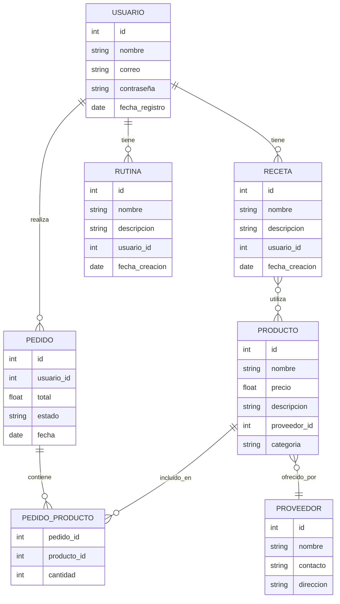

# Plantilla de Esquema de Base de Datos

_¿Cuáles son las entidades principales y relaciones en tu modelo de datos?_

## Entidades principales y relaciones

- **Usuario**: representa a los usuarios de la plataforma.
- **Receta**: contiene información sobre recetas de cuidado personal.
- **Rutina**: almacena rutinas personalizadas para los usuarios.
- **Producto**: productos recomendados y disponibles para compra.
- **Proveedor**: empresas o personas que ofrecen productos.
- **Pedido**: registro de compras realizadas por los usuarios.

**Relaciones:**
- Un **Usuario** puede tener muchas **Recetas** y muchas **Rutinas**.
- Un **Usuario** puede realizar muchos **Pedidos**.
- Un **Pedido** puede incluir varios **Productos**.
- Un **Producto** es ofrecido por un **Proveedor**.
- Una **Receta** puede estar asociada a varios **Productos**.

---

## Diagrama ER

<small>(Diagrama ER generado según la descripción de entidades y relaciones.)</small>

---

## Descripción

La plataforma de cuidado personal está diseñada para ofrecer a los usuarios un espacio donde puedan encontrar recetas, consejos y rutinas personalizadas para mejorar su bienestar. Los usuarios pueden acceder a recetas y rutinas creadas por ellos mismos o recomendadas por la plataforma. Además, pueden adquirir productos recomendados a través de un sistema de intermediación que conecta a los usuarios con proveedores confiables.

- Cada **Usuario** puede crear y gestionar sus propias **Recetas** y **Rutinas**.
- Los **Productos** recomendados pueden ser adquiridos mediante **Pedidos**, los cuales quedan registrados y asociados al usuario.
- Los **Pedidos** pueden contener varios productos y cada producto es ofrecido por un **Proveedor**.
- Las **Recetas** pueden estar asociadas a uno o varios productos, facilitando la compra directa de los ingredientes o artículos necesarios.

Este modelo permite brindar una experiencia integral, combinando información útil y acceso sencillo a productos de calidad, todo en un solo lugar.

<small>Agrega más entidades y relaciones a medida que tu proyecto crezca.</small>
